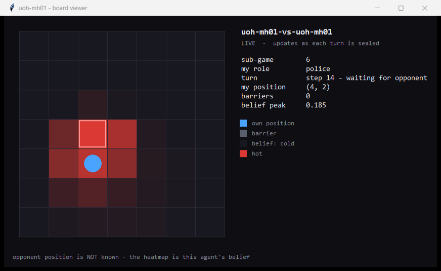
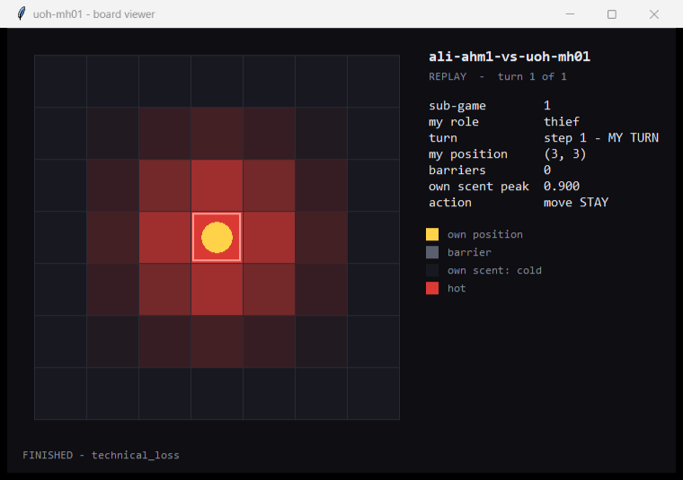
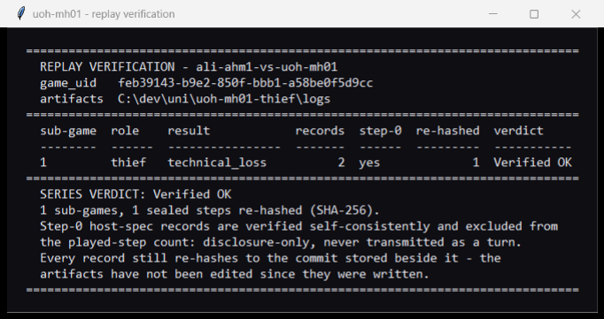

# Thief Agent - Distributed Cops-and-Robbers over P2P

**Group:** Hassarma-Agents (`uoh-mh01`)
**Role:** `thief`
**Companion repository (police agent): https://github.com/mohamadhassarma/uoh-mh01-police**

> Both repositories of this group must be cross-linked. This is the thief repo;
> the link above points at the police repo, and that repo links back here.

---

## 1. Formal model - Dec-POMDP

The race is a two-agent **decentralised partially-observable Markov decision
process**. "Decentralised" is not a modelling convenience here; it is enforced by
the architecture. There is no shared board, no shared memory and no shared module
between the two agents (rules #1/#2), so no process ever holds the world state at
all.

### State space

The underlying world state is `s = (cop position, thief position, barrier set,
per-side step counters)` on a `grid_size=7` board with `cop_start=(0,0)`,
`thief_start=(3,3)`, `max_barriers=14`, `max_moves=35` and
`survival_threshold=35` (`config/game.json`). **No agent ever observes `s`.**

What a peer actually holds is `OwnGameState` (`domain/own_state.py`):

| field | meaning |
|---|---|
| `board` | MY known barriers: mine plus every one the opponent declared |
| `own_pos` | MY position |
| `step_number`, `barriers_placed`, `survived_steps` | MY counters |
| `step_log` | MY own actions |

The opponent's position is **not a field**. This is the load-bearing design
decision of the whole project. An earlier version had an
`_OpponentPositionGuard` that blocked one attribute name on a state object which
still *held* the opponent's position - defeatable by any transitive path, and
`state.move_log` carried both positions anyway. A type that simply has no such
field cannot be defeated. The opponent exists **solely** as a belief
distribution (`domain/belief.py`).

`domain/state.py`'s `MatchState` does hold both positions, but it is the
single-process **simulator** used by `selftest` and the evaluation harness, not a
peer. `own_view()` projects it down to one side's `OwnGameState`, so a brain sees
the same restricted surface whether it is playing a real opponent or being
measured offline. A brain physically cannot read a position it is not given.

### Observations

Per turn, the only thing that crosses the wire is one `receive_turn` message
(`docs/WIRE.md`). The observation-bearing keys are:

- **`smell_grid`** - the sender's own pheromone field, a dict of
  `"r,c" -> intensity`. This is the primary positional evidence: it is emitted
  *around* the sender, so it localises them without naming a cell.
- **`hint`** - a natural-language claim by the sender about the sender's own
  rough whereabouts, phrased as one of nine named board regions
  (`domain/hints.py`). Never the exact cell, and never a claim about the
  receiver.
- **`barrier_placed`** - a declared barrier, which is ground truth: it changes
  the board for both sides.
- `step`, `timestamp`, `commit`, `capture_claim`, `claim_response`, `win_claim`.

### Uncertainty structure

Uncertainty is **two-layered**, and the layers are qualitatively different:

1. **Positional uncertainty.** The opponent's cell is never transmitted and never
   inferred exactly. The belief map is a probability distribution over the
   reachable set, updated from the scent field.
2. **Testimonial uncertainty.** The `hint` is a *self-report*, and the rulebook
   explicitly permits deception. A hint is therefore evidence about what the
   opponent *says*, not about where they are. It is folded in through
   `belief.apply_hint` as a `HintClaim` rather than trusted as an observation.

Two structural invariants hold on the belief map by construction, not by
convention (`domain/belief.py`): mass can never sit on a barrier or off-board
(the reachable set is recomputed against the current board on every call,
because barriers appear mid-match), and the map is always a valid distribution -
non-negative, summing to 1 over the reachable set.

### Action space

`N`, `S`, `E`, `W`, `STAY` for both roles, plus barrier placement for the police
(adjacent to its own cell, the only legal placement). Each agent selects from its
own belief alone; the joint action is never coordinated.

---

## 2. FastMCP orchestration dilemmas

### Push-then-poll, and why every tool is ack-only

All four MCP tools return `{"ok": True}` and nothing else:

| tool | required |
|---|---|
| `negotiate` | yes |
| `receive_turn` | yes |
| `submit_audit` | yes |
| `receive_control` | optional |

A handler **only enqueues**; it does no processing and returns no verdict. The
sender pushes, then polls its *own* inbox for the reply. This was the most
consequential transport decision in the project, and its consequence is that
**the opponent's verdict on me never crosses back**: each side computes its own
audit verdict independently, and the two artifacts have to agree by construction
rather than by negotiation. It also separates arrival from processing, so a slow
handler cannot stall the opponent's request.

### Three non-conflated timeouts

Deliberately separate, each enforced at a different layer
(`infra/watchdog.py`):

- **`response_timeout_sec`** (signed) - one single network request, enforced by
  `call_with_timeout` around one MCP call.
- **`turn_timeout_seconds`** (private, `game.toml`) - this peer's own wall-clock
  budget for one *whole* turn, local compute plus the network exchange. A
  timeout here self-forfeits rather than hanging.
- **`watchdog_timeout_sec`** (signed) - freeze detection across the whole match,
  tracked by explicit heartbeats and checked independently, so a bug that
  bypasses both per-turn budgets is still caught.

Every wait on the network in this codebase goes through `call_with_timeout`. An
opponent that goes silent cannot hang the process.

### The deadline tracker

`_call_with_retry` (`infra/mcp_client.py`) retries with exponential backoff -
1s, doubling to an 8s cap - until a **deadline**, rather than for a fixed number
of attempts. Two peers started by hand are never listening at the same instant,
so a refused connection early on is expected, not fatal. The elapsed clock is
taken from the watchdog's heartbeat when one is available, so our own retrying
cannot be mistaken for liveness.

### The connection pool

The outbound half originally built a fresh `Client` for every tool call, so one
turn cost a TCP connect plus a TLS handshake plus an MCP `initialize`
round-trip. Holding one connection per opponent URL for the life of the series
(`infra/mcp_pool.py`) produced, measured:

| | before | after |
|---|---|---|
| connections opened per series | 207 | **1** |
| per-call latency, localhost | 0.53s | **0.024s** |
| per-call latency, over tunnel | 1.99s | **0.219s** |

The latency was the smaller half of the argument. The real problem was a
**compatibility** defect: measured against a real ngrok free-tier edge, our
per-call connections tripped its per-minute cap after 17 calls in 39 seconds,
after which every connection was refused for about a minute - while the same
number of calls paced at 10/min all succeeded. An opponent sitting behind a free
tunnel would have had their edge knocked out by *our* churn, and the game would
have died with a `ConnectError` that reads like their fault. The pool is what
keeps a league game playable against hosting we do not control.

### The Orchestrator as single gateway

`PeerRuntime` (`orchestrator.py`) is the only object holding live match state,
one instance per process. It contains no decision logic (that is the brain) and
no transport (that is `infra/mcp_client.py` / `infra/mcp_server.py`); its job is
purely to coordinate the two. The two peers' runtimes share no memory, no file
and no module - MCP is the only channel between them.

### The Gatekeeper

Three separate mechanisms in front of every outbound third-party call, kept
distinct rather than collapsed into one "rate limiter" (`infra/gatekeeper.py`):

- **Token bucket** - shapes the ordinary call rate to the signed
  `requests_per_minute` (30), with a `queue_depth` ceiling (100) so a backlog is
  refused rather than growing without bound.
- **Quota manager** - the hard per-window ceiling. A bucket smooths bursts; a
  quota says "no more this window, at all". They are different guarantees, and a
  429 must be able to consume the quota without touching the bucket.
- **DOS detector** - a circuit breaker on our *own* behaviour. Once tripped it
  refuses locally and stops generating traffic at all.

A **429 is handled differently from every other failure**. The rulebook is
explicit that a 429 is not a transient fault and that insisting can get the
account suspended, so it burns the remaining quota window, backs off
exponentially, and counts toward the breaker. A generic "retry on error" path
that treats a 429 like a timeout is the specific mistake being guarded against.

---

## 3. Strategies implemented

### The belief map

A probability distribution over the reachable cells (`domain/belief.py`),
updated each turn in three stages:

1. **Decay toward uniform** (`_CONFIDENCE_BLEND = 0.05`). This is our own design
   choice, not a book-mandated formula: App F fixes the *physical* scent decay
   rate but says nothing about how confidence in a *belief* should erode absent
   new observations. Without some such regularisation, a cell driven to exactly
   zero by one observation could never recover even if the opponent later walked
   back through it - a plain likelihood-multiply Bayesian update has no
   forgetting term of its own.
2. **Likelihood update from the received `smell_grid`**, with a floor
   (`_LIKELIHOOD_FLOOR = 0.01`) so an unscented but reachable cell is never ruled
   out outright.
3. **Renormalise** over the reachable set, recomputed against the current board.

Hints enter separately through `apply_hint`, as a decodable region claim rather
than as a direct observation.

### `multiplicative_book_v1` and the three pinned ambiguities

The scent model implements the rulebook's own printed formula:

```
tau(t+1) = max(0, (1 - rho) * tau(t) + delta_tau)
```

We adopted the interop kit's `multiplicative_book_v1` registration because that
formula alone is under-specified in three ways, each of which makes two honest
implementations diverge silently (`domain/scent.py`):

1. **The deposit kernel is a verbatim 5x5 lookup, not a derivable formula.** The
   printed figure-4 kernel *looks* like a radial Gaussian, but the sigma-squared
   window that reproduces it under round-to-2dp (`[1.3178, 1.3327]`) is
   **disjoint** from the window that reproduces it under truncation
   (`[1.3436, 1.3538]`). Two teams each fitting "a Gaussian" in good faith get
   different, silently diverging fields. The 25 printed values are the only thing
   both can reach, so they are hard-coded rather than computed:

   ```
   0.04  0.14  0.20  0.14  0.04
   0.14  0.42  0.62  0.42  0.14
   0.20  0.62  0.90  0.62  0.20
   0.14  0.42  0.62  0.42  0.14
   0.04  0.14  0.20  0.14  0.04
   ```

   `emit()` refuses to run at any other `grid_size` / `center_intensity`, because
   the kernel is a constant valid only at App F's fixed values. It is not a
   scalable formula, and pretending otherwise would be a fabrication.
2. **An upper clamp at `center_intensity`.** The printed formula bounds only from
   below (`max(0, ...)`). Without an upper bound, a saturated cell that decays
   and is then redeposited on reaches `0.9*0.9 + 0.62 = 1.43`, outside the book's
   own declared tau range of `[0, 0.9]`. Documented as a reasoned deviation from
   an illustrative formula.
3. **Evaluation order is pinned** to `(1 - rho) * tau + delta`, not the
   algebraically identical `tau - rho * tau + delta`. The two are different
   IEEE-754 doubles on about 14% of the kit's own probed inputs, and this model is
   never rounded, so the bit pattern is what a peer's re-derivation must match
   turn over turn.

### Move selection

`ContainmentPoliceBrain` (`domain/police_brain.py`) is the outcome of
measurement, not of the first design that seemed reasonable:

- **Default to pursuit**, toward `best_local_hotspot` - a whole neighbourhood's
  summed belief mass, not a single-cell peak.
- **Take a barrier only when it demonstrably helps**: it must cut at least
  `_MIN_USEFUL_REDUCTION = 3` cells from the thief's reachable area, not merely
  more than zero.
- **And only in the second half of the sub-game.** "Late walls are precise" beat
  "early walls shape the game" by measurement, not by assumption.

The first version gated pursuit-versus-containment on the same belief-mass number
the PRD-05 baseline reports (0.32-0.35), but that baseline is a single-cell
*peak* while this brain's hotspot finder sums a whole *neighbourhood* (routinely
0.7-0.95). Compared against the wrong unit, the mass gate was satisfied almost
every turn and the distance gate alone did all the work - pushing the brain into
placing barriers next to its own cell whenever it was more than two cells from
the hotspot, which is most of a 7x7 board most of the time. A barrier next to the
police does nothing to a thief's reachable region far away, so this wasted turns
for no effect: **10.0%** win rate against `EvasiveThiefBrain` over 30 seeds,
worse than plain "always pursue the hotspot" at **30.0%**. Filtering barriers by
useful reduction restored parity (80 seeds: pursuit 30.0%, filtered 28.7% -
statistically indistinguishable); restricting containment to the second half
roughly doubled it (120 seeds: **50.8%** vs 29.2%).

The evader side of the same engine is `EvasiveThiefBrain`
(`domain/thief_brain.py`) - trail-breaking, threat-based evasion and
mobility-preserving move scoring. It is the thief every police figure in
section 4 was measured against, and it is selected through
`[strategy] thief_class` in `config/thief/game.toml`. Both repositories share
one codebase and therefore one belief map, one scent model and one wire
implementation; only the configured brain and the private `game.toml` differ.

Hints are template-generated, offline, zero tokens (`domain/hints.py`). Being
template-based rather than free text is what makes a hint *decodable*: the
receiver can recover an approximate claimed cell from the region name without
doing real language understanding, which is what lets `apply_hint` be called with
a real claim instead of remaining a theoretical hook.

---

## 4. Experiments

### The harness

`scripts/evaluate_strategies.py` plays N sub-games between any two named brains
at the real signed contract values, across a deterministic seed list, headless -
no network, no crypto (`domain/eval_match.py`). Each seed derives its own
police/thief RNGs with fresh brain instances and no shared mutable state between
games, so a result is reproducible from the seed alone.

**No run artifact is committed to this repository.** The figures below are
numbers that harness produced, recorded in `prd/PRD-05-strategy.md`. They are
reproducible by re-running it, but there is no saved CSV, JSON or plot in the
repo and none is claimed. There are also **no reinforcement-learning curves**,
because no learned policy is used anywhere in this project - the brains are
hand-written heuristics over the belief map, and presenting a learning curve
would be inventing one.

### Results, N=120 seeds, real contract values

Baseline for the argmax columns: 45.7% within 1 cell, 77.1% within 2 cells.

| Matchup (police vs thief) | police win rate | argmax within 1 | argmax within 2 |
|---|---|---|---|
| random vs random | 4.2% | 28.6% | 59.4% |
| random vs `EvasiveThiefBrain` | 1.7% | 32.7% | 63.2% |
| `ContainmentPoliceBrain` vs random | 68.3% | 27.0% | 54.4% |
| `ContainmentPoliceBrain` vs `EvasiveThiefBrain` | 48.3% | 27.3% | 54.3% |

The finding that mattered later: `EvasiveThiefBrain` cuts the police win rate by
20 points (68.3% -> 48.3%) while leaving argmax accuracy **unchanged**
(27.0/54.4 -> 27.3/54.3, within noise). Suppressing the police's belief accuracy
and suppressing the police's win rate turned out to be two different, separable
effects, and that thief brain only demonstrably achieves the second. Its
effectiveness is in its *movement* - trail-breaking, threat-based evasion,
mobility-preserving move scoring - not in confusing the belief map itself.

### Live viewer

The GUI renders the board, own position, barriers and the belief map as a
heatmap, updating while a series runs. The opponent's position is never drawn,
because it is never known; the footer says so explicitly.



The same viewer over a finished series. The heat layer here is the agent's own
transmitted scent field rather than its belief, because that is what the log
contains - belief is internal state and was never sealed, so no replay can
honestly claim to show it. The label changes to match.



### Replay verification

`replay` re-hashes every sealed record with SHA-256 and compares it against the
commit stored beside it, reusing `infra/audit.py` rather than reimplementing the
hashing - a second hash implementation would prove nothing about the first if it
agreed, and would report an honest series as tampered if it did not. Run against
the real `ali-ahm1` series: 6 sub-games, 207 sealed steps, `Verified OK`.



Step-0 records are verified self-consistently and excluded from the played-step
count, since they are disclosure-only and never transmitted as a turn.

---

## 5. Results and reflection

### Three opponents, one brain, opposite extremes

| Opponent | Series | Outcome |
|---|---|---|
| `ali-ahm1` | 3 series, 18 sub-games | **Zero captures in either direction.** 47-47 every time. |
| `AmalOnly` | friendlies + 1 counted | Near-total captures. Counted series settled **77-77**, both sides reported. |
| `khm-mn17` | 2 friendlies | **90-30** and **80-35** against us. Their thief evaded our police every time; their police captured ours repeatedly. |

The same `ContainmentPoliceBrain`, unchanged, produced total stalemate, total
capture, and total defeat against three different opponents.

### Sensitivity to evader quality

The harness predicted the shape of this and we under-read it.
`EvasiveThiefBrain` cost the police 20 points of win rate purely through
movement quality, with belief accuracy unchanged. The live results are that same
curve extended past both ends of the range we tested:

- Against **AmalOnly**'s thief, capture was near-total. The evader was easier
  than our own `EvasiveThiefBrain`, and the pursuit heuristic converged almost
  every sub-game.
- Against **ali-ahm1**, 18 sub-games produced not one capture in either
  direction. Two containment-style policies on a 7x7 board with a 35-step ceiling
  reach a stable standoff: our brain pursues a hotspot, theirs evades it, and
  neither closes before the ceiling. The tie rule then adds 2 to both totals,
  giving the identical 47-47 three times over. A draw repeated three times is not
  noise - it is the fixed point of two policies that cannot break each other.
- Against **khm-mn17**, the suppression was total in both directions at once.
  Their thief was a strictly better evader than anything we measured against, and
  their police solved a pursuit problem ours does not.

The honest reading is that **our police brain is calibrated to our own thief**.
Every threshold in it - `_HOTSPOT_RADIUS = 2`, `_MIN_USEFUL_REDUCTION = 3`, the
second-half containment window - was tuned by measuring against
`EvasiveThiefBrain`, a brain we also wrote. That is a closed loop. The 50.8%
figure is a real measurement, but what it measures is our brain against our own
assumptions about evasion, and those assumptions did not transfer. A genuinely
diverse opponent pool during development, rather than self-play plus a single
sparring peer, is the thing that was missing.

### Every real defect surfaced on contact with foreign code

This is the reflection that matters most, and it is uncomfortable. The test suite
is large and was green throughout. **Not one of the following was caught by it.**
Each was found by playing, or by reading, someone else's implementation:

1. **The step-0 audit bug.** We failed the interop kit's sparring peer for
   revealing a step-0 record, because we demanded a live commit for a record that
   is disclosure-only and never transmitted as a turn. Both of our own peers made
   the same assumption, so both agreed and the suite stayed green.
2. **`legal_actions` using the opponent's position.** A move generator reading a
   coordinate a peer must not hold. Invisible in a single-process simulator that
   legitimately holds both positions.
3. **`_report_counted_series` called by nothing.** The automatic end-of-series
   report was defined, documented and tested - and the peer command never called
   it. A counted series ran to completion and sent nothing, silently, with no
   banner and no reason. Every test called the helper directly, so no test could
   observe that nothing called the helper.
4. **`capture_landing` invisible for three series.** We emitted our internal
   capture taxonomy as the wire result string. That name appears in no book, no
   reference and no interop vector, and a conforming peer scores it 0/0 to both
   sides. It went out on the wire and into artifacts for six sub-games against a
   live opponent before anyone noticed - and `docs/WIRE.md` had documented the
   correct vocabulary all along. Only the code disagreed.
5. **Reading the opponent's `github_commit` from the negotiate identity.** We
   read theirs from the identity block while emitting our own only in the sealed
   step-0 record: a **double standard against our own emit path**. The identity
   copy is a series headline anyway, when rule 53 binds the per-role,
   per-sub-game commit. Against an opponent who does it correctly, all six
   sub-games reported null and the automatic send refused. Worse, we discarded
   their revealed chain after auditing it, so the value was not merely unread -
   it was unreachable.

The common thread: **a test suite written by one team, run against that team's
own two peers, validates a shared assumption rather than a specification.** Both
of our peers share a codebase, so any mistake in the shared understanding is
symmetric and therefore invisible from inside. Every one of these was caught by a
foreign implementation disagreeing with us - the sparring peer, the reference
implementation, the interop kit's vectors, or an opponent's raw receiver-side
observation. The suite's value was in stopping regressions once a defect was
known; it had no power to find one.

---

## Repository contents (mandatory checklist)

- [x] `README.md` - this academic report
- [x] `config/` - `game.json` (signed shared contract) + `thief/game.toml` (private)
- [x] `prd/` - one PRD per development stage
- [x] `PLAN.md` - development plan
- [x] `TODO.md` - task list
- [ ] Annotated git tag `v1.0-submission` pushed
- [x] GUI belief-map screenshot attached (`docs/screenshots/gui-live.png`)
- [x] Replay screenshot with `Verified OK` attached (`docs/screenshots/replay-verified.png`)
- [x] No secrets committed (`credentials.json`, `token.json` are gitignored)

## Running

```powershell
uv sync
uv run python -m uoh_mh01 peer --role thief
```

Re-verify a played series from its artifacts (stage 6):

```powershell
uv run python -m uoh_mh01 replay --game-id <their-group>-vs-uoh-mh01
```

Watch a live series on the board, or replay a played sub-game:

```powershell
uv run python -m uoh_mh01 gui
uv run python -m uoh_mh01 gui --game-id <their-group>-vs-uoh-mh01 --sub-game 1
```

## Process separation

The police and thief agents **must** run as two fully separate processes under
separate configuration directories. This repository contains the `thief` side only.
No shared memory, no shared variables, no shared live module between the two roles.

## References

- The rulebook (`docs/police_thief_p2p.pdf` in the reference repo below) is the sole
  binding specification.
- [`rmisegal/Game-P2P-Cop-Chase`](https://github.com/rmisegal/Game-P2P-Cop-Chase) -
  the course's official reference implementation. Read for understanding and
  cross-checked against; no code from it is vendored into this repository.
- [`Imreec/copthief-league-protocol`](https://github.com/Imreec/copthief-league-protocol) -
  a student-authored interop/conformance kit pinning byte-level wire constructions
  (canonical JSON, commit-reveal, agreement signatures, `game_id`/`game_uid`) the
  rulebook leaves as prose. Not a specification; consulted for PRD-03/PRD-07 and
  credited here per its own terms. No code from it is vendored into this repository -
  its published test vectors are ported into this project's own test suite as
  fixtures instead (stage 3).
